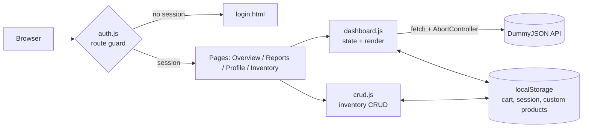
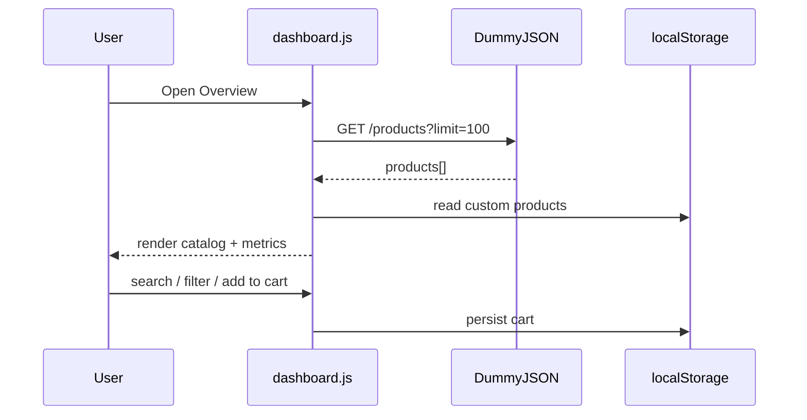

# Enterprise Dashboard: Capstone

A framework-free, accessible product dashboard: simulated authentication with roles, a live-API catalog, full CRUD inventory management, and persistent client state.

**Live demo:** `https://shruch123.github.io/enterprise-dashboard/pages/login.html` &nbsp;|&nbsp; **Repo:** `https://github.com/shruch123/enterprise-dashboard.git`

## Feature highlights
- **Auth simulation** with `admin` (full CRUD) and `viewer` (read-only) roles, route guard on every page, and sign-out
- **Interactive catalog**: live DummyJSON data, search, category tabs, sorting, skeleton loading, error and retry states
- **CRUD**: create, edit, and delete custom products; they merge into the catalog
- **Persistent state**: cart, session, and inventory in `localStorage`, with `try/catch` guards
- **Accessibility**: skip link, landmarks, live regions, native `<dialog>`, `:focus-visible`, reduced-motion support
- **Responsive**: 320px to 1440px (see `docs/responsive-test.md`)

## Demo accounts
| Role | Email | Password |
|---|---|---|
| Admin | `admin@demo.test` | `Admin123!` |
| Viewer | `viewer@demo.test` | `Viewer123!` |

> Authentication is a **client-side simulation** for learning. Credentials sit in the JS bundle, so never use this pattern for real security. A production version needs a server (e.g. OAuth/OIDC + HTTP-only session cookies).

## Architecture




## Project structure
```
index.html            Overview + catalog + cart
pages/                login, reports, profile, products (CRUD)
css/                  dashboard.css (design system), capstone.css
js/                   auth.js, dashboard.js, crud.js
docs/                 design system, async notes, test matrices
netlify.toml
```

## Run locally
```bash
python3 -m http.server 8080   # then open http://localhost:8080/
```
Serve over HTTP (not `file://`) so `fetch()` works.

## Deploy
**Netlify (drag and drop):** go to app.netlify.com/drop and drop the project folder.
**Netlify (Git):** push to GitHub, then *Add new site → Import from Git*; build command empty, publish directory `.`.
**GitHub Pages:** *Settings → Pages → Deploy from branch → main / root*. Relative links already work under a sub-path.
**Cloudflare Pages / Vercel:** import the repo, framework "None", output directory `.`.

## Testing
See `docs/validation-checklist.md` and `docs/responsive-test.md`. Still to do manually: keyboard-only pass, screen-reader smoke test, contrast audit, W3C validation of the 4 HTML pages.

## Known limitations
- Simulated auth and localStorage are per-browser, with no shared backend
- DummyJSON is read-only, so custom products live only in your browser
